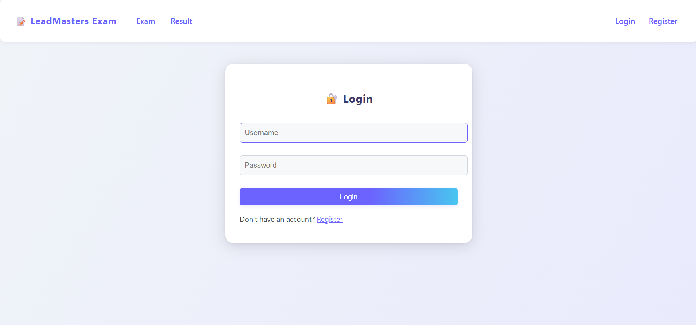
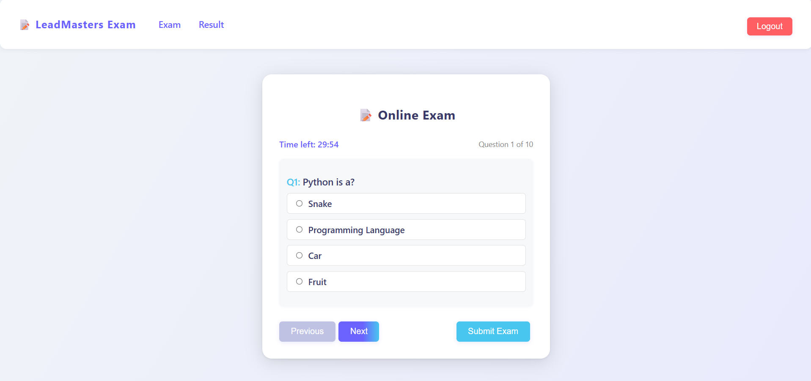
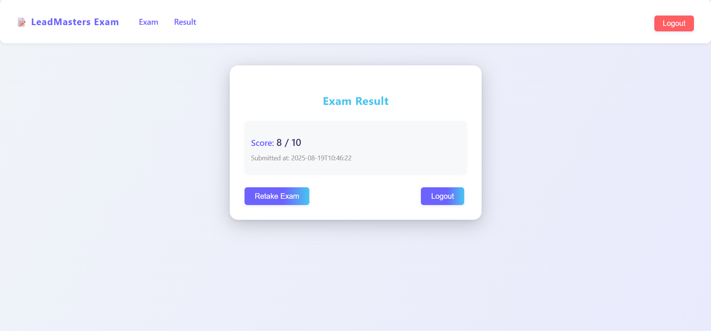

# LeadMasters Exam App

A full-stack, production-ready online exam-taking application for students, built with **React.js** (frontend), **FastAPI** (backend), and **MySQL** (database).

---

## Features
- Student registration and login with JWT authentication
- Randomized MCQ exam (10 questions per attempt)
- 30-minute timer with auto-submit
- Modern, professional UI (responsive and mobile-friendly)
- Navigation bar with context-aware links
- Exam result page with score and submission time
- Robust error handling and user feedback
- Secure backend with CORS and token validation

## Tech Stack
- **Frontend:** React.js (Vite), Axios, React Router DOM, Modern CSS
- **Backend:** FastAPI, SQLAlchemy, MySQL, JWT, Pydantic
- **Database:** MySQL

## Project Structure
- `backend/` — FastAPI app (API, models, auth, DB)
- `frontend/` — React.js app (pages, components, API helpers)
- `postman_collection.json` — Postman collection for API testing

## Quick Start

### 1. Backend Setup
1. Install Python 3.9+ and MySQL.
2. Create a MySQL database (e.g., `leadmasters_exam`).
3. Configure DB connection in `backend/.env`.
4. Install dependencies:
	```bash
	pip install -r requirements.txt
	```
5. Run migrations (if any) and start the server:
	```bash
	uvicorn app.main:app --reload
	```

### 2. Frontend Setup
1. Install Node.js (v16+ recommended).
2. In `frontend/`:
	```bash
	npm install
	npm run dev
	```
3. Open [http://localhost:5173](http://localhost:5173) in your browser.

### 3. Usage
- Register a new student account.
- Login to access the exam.
- Complete the exam (random MCQs, 30 min timer).
- Submit to view your result.
- Only logged-in users can view results.

## API Testing
- Use the provided `postman_collection.json` for backend API testing.

## Screenshots
## Screenshots

### Login Page


### Exam Page


### Result Page


> If images are not visible, make sure you have committed the screenshots to the correct folder and pushed them to GitHub.

---

**Author:** LeadMasters Team
**License:** MIT
